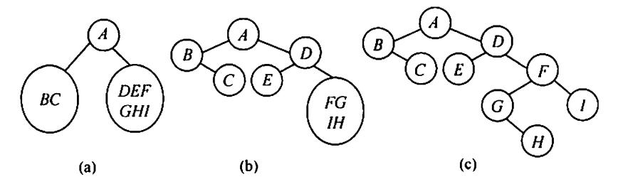

### 树与二叉树

#### 基本术语

- 树中一个结点的孩子个数称为该结点的度，树中结点的最大度数称为树的度。
- 树中结点的各子树从左到右是有次序的，不能互换，称该树为有序树，否则称为无序树。

#### 树的性质

- 树中的结点数等于所有结点的度数之和加 1 。（树的结点数 = 树的分枝数 + 1）
- 度为的 $m$ 树中第 $i$ 层上至多有 $m^{i-1}$ 个结点($i\ge 1$)。
- 高度为 $h$ 的 $m$ 叉树至多有 $(m^h-1)/(m-1)$ 个结点。（等比数列求和公式）
- 具有 $n$ 个结点的 $m$ 叉树的最小高度为 $\lceil \log_m(n(m-1)+1) \rceil$ 。

#### 二叉树

- 二叉树是有序树，若将其左、右子树颠倒，则成为另一棵不同的二叉树。
- **满二叉树**：一棵高度为 $h$ 且含有 $2^h-1$ 个结点的二叉树称为满二叉树，即树中的每层都含有最多的结点。
- **完全二叉树**：高度为 $h$、有 $n$ 个结点的二叉树，当且仅当其每个结点都与高度为 $h$ 的满二叉树中编号为 $1～n$ 的结点一一对应时，称为完全二叉树。
- **二叉排序树**：左子树上所有结点的关键字均小于根结点的关键字；右子树上的所有结点的关键字均大于根结点的关键字；左子树和右子树又各是一棵二叉排序树。
- **平衡二叉树**：树上任一结点的左子树和右子树的深度之差不超过 1 。

#### 二叉树的性质

- 非空二叉树上的叶子结点数等于度为 2 的结点数加 1 ， 即 $n_0=n_2+1$ 。

  推导： 已知 $n=n_0+n_1+n_2$，分枝总数 $B=1\times n_1 + 2\times n_2$

  则 $n=B+1=n_0+n_1+n_2=1\times n_1 + 2\times n_2 + 1$

  即 $n_0=n_2+1$

- 非空二叉树上第 $k$ 层上至多有 $2^{k-1}$ 个结点。（$k\ge 1$，等比数列的项）
- 高度为 $h$ 的二叉树至多有 $2^h-1$ 个结点 。（$k\ge 1$，等比数列求和）
- 对完全二叉树按从上到下、从左到右的顺序依次编号 $1,2,\cdots, n$，当 $i>1$ 时，结点 $i$ 的双亲的编号为 $\lfloor i/2\rfloor$，左孩子编号为 $2i$，右孩子编号为 $2i+1$，结点 $i$ 所在层次（深度）为 $\lfloor \log_2 i \rfloor+1$ 。
- 具有 $n$ 个（$n > 0$）结点的完全二叉树的高度为 $\lceil \log_2 (n+1) \rceil$ 或 $\lfloor \log_2 n \rfloor+1$ 。（根据性质 3 推导，$2^{h-1}-1 < n \le 2^h-1$）
- 链式存储结构二叉树中，非空指针数 = 总分枝数 = $n-1$，总指针数 = 2 $\times$ 总结点数，空指针数 = 2 $\times$ 结点总数 - 非空指针数 = $2n-(n-1)=n+1$ 。
- 完全二叉树中，$n=n_0+n_1+n_2=n_0+n_1+(n_0-1)=2n_0+n_1-1$，而 $n_1$ 只能取 0 或 1 。
- 一棵高度为 $h$ 的满 $m$ 叉树有如下性质：
  - 第 $i$ 层有 $m^{i-1}$ 个结点。（$1\le i \le h$）
  - 结点 $i$ 的第 1 个孩子编号为 $j=(i-1)\times m + 2$ ，第 $k$ 个孩子结点的编号为 $(i-1)m+k+1$。（$j=i\cdot m$ 为结点 $i$ 的倒数第 2 个孩子，则第 1 个孩子编号为 $j=i\cdot m + 2 - m$）
  - 结点 $j$ 的双亲的编号是 $i=\lfloor (j-2)/m \rfloor + 1$ 。（只有当 $j$ 为 $i$ 的倒数第 2 及 最后一个孩子时，才有 $i=\lfloor j/m \rfloor$，所以需要将所有 $i$ 的孩子 $j$ 的序号统一加上 $m-2$，即 $i=\lfloor (j+m-2)/m \rfloor$）

#### 由遍历序列构造二叉树

- 由二叉树的先序序列和中序序列可以唯一地确定一棵二叉树。在先序遍历序列中，第一个结点一定是二叉树的根结点 ；而在中序遍历中，根结点必然将中序序列分割成两个子序列，前一个子序列是根结点的左子树的中序序列，后一个子序列是根结点的右子树的中序序列。根据这两个子序列，在先序序列中找到对应的左子序列和右子序列。在先序序列中，左子序列的第一个结点是左子树的根结点，右子序列的第一个结点是右子树的根结点。如此递归地进行下去，便能唯一地确定这棵二叉树。
- 由二叉树的后序序列和中序序列也可以唯一地确定一棵二叉树。因为后序序列的最后一个结点就如同先序序列的第一个结点，可以将中序序列分割成两个子序列，然后采用类似的方法递归地进行划分，进而得到一棵二叉树。
- 由二叉树的层序序列和中序序列也可以唯一地确定一棵二叉树。
- 只知道二叉树的先序序列和后序序列，则无法唯一确定一棵二叉树。
- 例如，求先序序列 (ABCDEFGHI) 和中序序列 (BCAEDGHFI) 所确定的二叉树。
  
